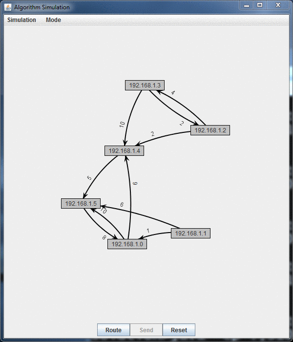

# Network Simulator

## Assignment Objectives
- Write a program which simulates a computer network.
- Create and use a _graph_ data structure.
- Create and use a _hash table_ data structure.
- Apply basic knowledge of Big-O trade offs.

## Assignment Overview
Professional code often uses existing libraries to quickly prototype interesting programs. You are going to use 2-3 established libraries to quickly develop the internal representation of two advanced data structures (a graph and a hash table) and simulate a simple computer network.

## Tasks Overview

- Task 1: Examine the JCF Classes (0%)
- Task 2: Read the Provided Code Base (0%)
- Task 3: Implement a Directed Graph Class to Support the Network Structure (60%)
- Task 4: Implement a Hash Table Class to Support the Network Routing (20%)
- Task 5: Finish Dijkstra's Shortest Path Algorithm in the Simulator (20%)
